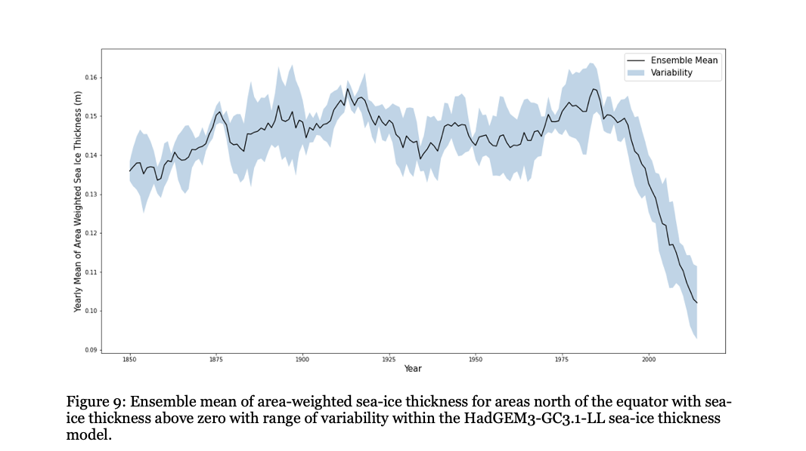

**EXPLORING SEA-ICE THICKNESS WITHIN THE CCCMA CANESM5 MODEL**

Alison Deere

> ATSC448 - Directed Studies

**Table of Contents**

Summary ……………………………………………………………………………………………………………. 3

Motivation/Background ……………………………………………………………………………….………. 3

Motivation ………………………………………………………………………………………………… 3

Data Used …………………………………………………………………………………………………. 4

Analysis Techniques ………………………………………………………………………………………….…. 6

Data Format …………………..…………………………………………………………………….……. 6

Qualitative Analysis ……………………………………………………………………………………. 6

Estimating Natural Variability ………………………………………………………………….…. 6

Taylor Diagrams ………………………………………………………………………..………………. 7

Results ………………………………………………………………………………………………………….…… 8

Historical Simulation …………………………………………………………………………………. 8

Future Scenarios ………………………………………………………………………………………. 12

HadGEM3-GC3.1-LL …………………………………………………………………..……………. 13

Comparison …………………………………………………………………………………………..…. 15

Conclusion ………………………………………………………………………………………………..….…… 19

References ……………………………………………………………………………………………….……… 20

**Summary**

Sea-ice thickness in the arctic is decreasing. As climate change
continues to progress, both surface and sea temperatures will continue
to rise. This will contribute to the melting of sea-ice, and impact
communities and wildlife who depend on the sea-ice to survive. Within
this directed studies research project, sea-ice thickness simulated by
the Canadian Earth System Model version 5 will be analyzed. This model
will be compared to the Hadley Centre Global Environment Model to
determine if there are significant differences between the two.
Quantitative and qualitative analyses are performed, extending to both
the spatial and temporal extent of the sea-ice thickness models.
Overall, the two models predict dramatic decreases in sea-ice thickness
both in the historic simulation and in future emissions scenarios, and
significant differences were found between the two models.

**Motivation/Background**

**Motivation**

It is a common belief “that climate change will be felt first —and to a
greater extent—at high latitudes versus temperate regions” (Pickart,
2018). With climate change comes warmer temperatures, and a loss of
sea-ice in the arctic. This loss of sea-ice will impact indigenous
communities in Canada’s arctic who rely on sea-ice for transportation,
as well as arctic marine mammals and fish as “staples of their
traditional diets” (Panikkar & Lemmond, 2020). Accurate and extensive
sea-ice models are very important, to both understanding how sea-ice has
changed historically as well as looking into the future. These models
can be used to influence policies around mitigation and helping local
communities adapt to changing sea-ice conditions.

Sea-ice thickness and extent models are very important, but sea-ice can
be a very difficult phenomenon to model due to the complex interaction
of the Earth’s atmosphere and oceans. Often, the details in the model
predictions do not agree with observations. However, at a macro scale,
it has been observed in both models and observations, that arctic
sea-ice area has “decreased rapidly” (Notz & Community, 2020) in recent
decades as anthropogenic greenhouse gas emissions have continued to warm
global temperatures.

The purpose of this directed studies research project is to analyze the
Canadian Earth System Model Version 5 (CanESM5) from the Canadian Centre
for Climate Modelling and Analysis (CCCma) within phase 6 of the coupled
model inter-comparison project (CMIP). In this project, both historic
simulations from 1850-2014 and future emissions scenarios from 2015 to
2100 will be examined using various qualitative and quantitative
methods. The CanESM5 model will be compared with the Hadley Centre
Global Environment Model (HadGEM) from the Met Office Hadley Centre in
the United Kingdom, using statistical Taylor diagrams.

**Data Used**

In this study, publicly available data was used from the sixth phase of
the coupled model inter-comparison project, and focused on the CanESM5
and HadGE34-GC3.1-LL models. These are described in more detail below.

**CanESM5**

The Canadian Earth System Model version 5 is the current version of the
Canadian Centre for Climate Analysis’ global model. There were many
improvements to the model between the last iteration (version 2), and
the current model. The update includes improvements to the atmosphere,
land surface, and terrestrial ecosystem models, and the implementation
of completely new models for the ocean, sea-ice, and marine ecosystems
(Swart et al., 2019).

Within CanESM5, the atmosphere is represented by the Canadian Atmosphere
Model, which includes the Canadian Land Surface Scheme and the Canadian
Terrestrial Ecosystem model. The ocean is simulated using the LIM2
sea-ice model which is run within the Nucleus European Modelling of the
Ocean model (NEMO) framework. The ocean biogeochemistry is represented
by the Canadian Model of Ocean Carbon. The atmosphere and the ocean
components of this model are coupled by the Canadian Coupler, and LIM2
provides the sea-ice concentration, snow and ice thickness to the
atmospheric model, via the coupler (Swart et al., 2019).

The CanESM5 model has a resolution of approximately 2.8° for the
atmosphere, and 1° for the ocean (Swart et al., 2019). The spatial
extent for the CanESM5 sea-ice model is 360 by 291 grid cells (longitude
by latitude). In the historical simulations, there are 1980 time-steps
ranging from 1850 to 2014, and in the future emissions scenarios there
are 1032 time steps, ranging from 2015 to 2100.

The Canadian Earth system model has 40 ensemble members for the
historical simulations of sea-ice thickness in CMIP6. These ensemble
members were generated by launching historical runs at 50-year intervals
off the pre-industrial configuration simulation. The 50-year interval
was chosen to allow for differences in multi-decadal ocean variability
between ensemble members (Swart et al., 2019).

**HadGEM3-GC3.1-LL**

The Met Office Hadley Centre has three models in CMIP6. In this project,
the focus will be on the HadGEM3-GC3.1-LL model and it will be used to
perform a comparison with the CanESM5 model. The HadGEM3-GC3.1-LL model
is the latest configuration of the Global Coupled model, and it includes
component configurations Global Atmosphere 7.1, Global Land 7.0, Global
Ocean 6.0, and Global Sea Ice 8.1 (Williams et al., 2018). The global
sea ice component is embedded in the NEMO ocean configuration, and uses
a tripolar grid. The atmosphere model and the ocean model are coupled by
the OASIS-MCT coupler (Ridley et al., 2018). The HadGEM3-GC3.1-LL has
four ensemble members with the intent of mitigating the “impact of model
internal variability when analyzing the ensemble mean fields” (Andrews
et al., 2020). The initial conditions for the historical simulation
ensemble members were taken from a variety of points during the
numerical integration of the pre-industrial configuration simulation run
(Andrews et al., 2020).

**Coupled Model Inter-comparison Projects**

Coupled model inter-comparison projects are sets of model results that
are released in the lead up to each intergovernmental panel on climate
change assessment report. CMIP6 is associated with the IPCC sixth
assessment report and consists of runs from around 100 climate models,
produced across 49 different modelling groups. Within CMIP6 there are
historical simulations as well as 22 specialized experiments or model
inter-comparison projects, that modelling groups can choose to
participate in (CMIP6, 2019). This project will focus on historical
simulations, as well as the modelling inter-comparison project
ScenarioMIP, which looks at future emissions scenarios.

Projections of future climate scenarios play an integral role in
improving understanding of our climate system, and in the case of this
research project, how sea-ice thickness will continue to change into the
future. The scenario model inter-comparison project consists of 8
alternative 21st century scenarios. Each scenario represents a different
representative concentration pathway (RCP). This project has focused on
two: the SSP2-4.5 and SSP5-8.5 scenarios. SSP2-4.5 and SSP5-8.5 “are the
middle and high end of the range of future forcing pathways,
respectively, updating the RCP4.5 and RCP8.5 pathways” (Wei et al.,
2020). RCP8.5 corresponds to the scenario of the highest level of
greenhouse gas emissions. It stabilizes radiative forcing at 8.5
Wm-2 and is the worst case scenario (Riahi et al., 2011).
RCP4.5 assumes that some climate policies are created that limit the
extent of greenhouse gas emissions, and stabilizes radiative forcing at
4.5 Wm-2 (Thomson et al., 2011).

**Analysis Techniques**

**Data Format**

The data used for this research project came from CMIP6, and is in the
format of xarray datasets with dask arrays of sea ice thickness,
latitude, and longitude. All of the analysis techniques described below
were implemented using the python programming language. Monthly sea-ice
thickness projections for the CanESM5 and HadGEM3-GC3.1-LL models were
used. The historical sea-ice thickness simulations covered the period
from 1850 – 2014, and the future emissions scenarios covered the period
from 2015-2100.

**Qualitative Analysis**

This research project began with a qualitative analysis of the data
within CanESM5. The analysis focused on the entire spatial extent for a
given snapshot in time, as well as the entire temporal extent looking at
spatial averages of the model. To examine the entire spatial extent, two
sets of polar plots were created. The first looks at one ensemble member
and has the intent of showing how the polar sea-ice thickness has
changed from 1850-2014. The second looks at all of the ensemble members
within CanESM5 and is used to explore the variability in sea-ice
thickness between the ensemble members. These polar plots were created
with the Matplotlib python library (Hunter, 2007), and a function was
created to attempt to decrease the visible seam that is visible in the
north pole. The polar plots show the extent from 60 degrees north to 90
degrees north. The temporal variation of sea-ice thickness was examined
by calculating yearly means of area weighted sea-ice thickness.

**Estimating Natural Variability**

Given that the CanESM5 model has 40 ensemble members, we can use the
variability between the models as an estimate of natural variability.
There is variation between the ensemble members shown in the polar plot
in Figure 3. To further explore this and to analyze the sea ice
thickness trends without the internal variability between the different
members, the ensemble mean and variability between models were
calculated. These calculations were performed for the historical
simulations of the CanESM5 and HadGEM3-GC3.1-LL models, as well as for
the future emissions scenarios. Standard deviation was used as a measure
for variability. The sea-ice thickness in Figure 4 is area-weighted,
only examines the sea ice north of the equator, and is calculated only
with grid cells with a sea-ice thickness greater than zero. Figure 5
shows the spread of the variability between the models, calculated as
the range of standard deviation.

**Taylor Diagrams**

To perform quantitative comparisons between the CanESM5 and
HadGEM3-GC3.1-LL models, Taylor Diagrams were used. A Taylor diagram can
“concisely summarize the degree of correspondence between simulated and
observed fields” (Taylor, 2001). The Taylor diagram looks at three
statistics: the correlation coefficient between the reference and model
dataset, the centred pattern root-mean-square difference, and the
standard deviation. The following two equations give the correlation
coefficient (R) and the centred pattern root-mean-square difference (E)
(Taylor, 2001).

On a Taylor diagram, the spatial correlation between the reference
dataset and the model dataset is given by the azimuthal position on the
diagram, the centred pattern root-mean-square difference is proportional
to the distance from the reference point on the x-axis, and the standard
deviation is proportional to the radial distance from the origin. The
Taylor diagrams for this project were created using the Skill Metrics
python library (Rochford, 2021).

**Results**

**Historical Simulation**

The CMIP6 historical simulation ranges from 1850 to 2014. The following
figure shows the CanESM5 model in its first time step (1850) on the
left, and in its last time step (2014) on the right.

The above figure alone shows that the CanESM5 model predicts a decrease
in sea-ice thickness from 1850 to 2014. On the left, the blue is darker
over the ocean than on the right, which represents thicker sea-ice. To
further analyze the loss of sea-ice thickness over the 164 year period,
polar plots were created for every decade.

From Figure 2, we can see the changes in sea-ice thickness from 1850 to
2014. As the years go by, the sea-ice decreases, and in this figure, the
ocean becomes lighter and lighter blue. As will be further discussed
below, the sea-ice thickness was modelled to remain approximately
constant in the arctic from 1850 - about 1970. In Figure 2, we can see
qualitatively that the difference in the colour of blue from the 1850
plot (row 1, column 1) to the 1960 plot (row 2, column 6) is not that
extreme. However, if we compare the 1970 plot (row 3, column 1) to the
2014 plot (row 3, column 6), there is a large difference in the shade of
blue over the ocean. Most of the decrease in sea-ice thickness has
occurred over the last 50 years. By 2014 the sea-ice in the middle of
the arctic ocean is approximately 1-2 m thick. Figures 2 and 3 were
created with only one ensemble member from the CanESM5 model. To look
into the variability of all of the ensemble members within the model, an
additional figure had to be created.

Figure 3 shows all 40 of the ensemble members within CanESM5 in 1850.
The qualitative colour scheme is chosen to showcase the variability
between members. For example, ensemble member r39i1p2f1 (row5, column 7)
has a much thicker sea-ice in the middle of the ocean. To further
explore the variability within the model, area-weighted sea-ice
thickness was calculated, along with the ensemble mean and standard
deviation between the different ensemble members.

Looking at ensemble member predictions can aid in separating long term
climate effects from changes that are “inherent to the climate system”
(Bengtsson & Hodges, 2019). Figure 4 clearly illustrates the decreasing
trend of sea-ice thickness, with the greatest standard deviation being
0.0091 m. The thickness of sea-ice in Canada’s arctic has been
decreasing since the model’s initialization in 1850. Time 1850 in this
plot corresponds to the ensembles examined in Figure 3. Figure 4 shows
that while there is internal variability between the 40 ensemble members
due to different initial conditions, the overall trend of sea-ice
thickness is an almost linear decrease after approximately 1975. This
was discussed earlier with the polar plots from 1850-2014, and the trend
holds in these figures. From 1850 to 1975, the sea-ice thickness stayed
approximately constant, around 0.14 m. After 1975, yearly mean of area
weighted sea-ice thickness decreased dramatically. In the next section
there is further analysis of the sea-ice thickness after 2014.

**Future Scenarios**

CMIP6’s scenario model
inter-comparison project has 8 alternative 21st century
emissions scenarios. Figure 6 shows SSP2-4.5 and SSP5-8.5 in the CanESM5
model. It is clear that the trend that was noted in Figures 4 and 5 is
set to continue into the future. Even with climate polices being enacted
over the next 80 years, which the simulation SSP2-4.5 takes into
account, there will be a dramatic decrease in sea-ice thickness.

If the other emissions scenarios available within CMIP6 were plotted on
Figure 6, they would bracket the blue curve and would all be above the
red curve. If the SSP2-4.5 scenario becomes reality, then by 2100 the
yearly mean of area weighted sea ice thickness would be around 0.05 m,
and would be 0.02 m if the SSP5-8.5 scenario comes to fruition.

**HadGEM3-GC3.1-LL**

The Met Office Hadley Centre’s HadGEM3-GC3.1-LL model was chosen to
compare to the CCCma’s CanESM5 sea-ice thickness model. Below are the
four ensemble members that make up the HadGEM3-GC3.1-LL model in 1850.

As with the CanESM5 polar plots above (Figure 3), there is internal
variability between the models, though there is less overall
variability. The arctic sea-ice for these four ensemble members in 1850
is approximately 2-4 m thick in the middle of the ocean. In Figure 3,
there were ensemble members from the CanESM5 model that simulated
sea-ice both thicker and thinner in areas than these four ensemble
members. To further examine the HadGEM3-GC3.1-LL model in preparation to
comparing it with the CanESM5 model, the ensemble mean and standard
deviation were calculated.

Similarly to the CanESM5 model’s ensemble mean and variability figures,
Figure 8 and Figure 9 highlight the variability between the ensemble
members within the model. With only four ensemble members within the
HadGEM3-GC3.1-LL model, there is less internal variability than within
the CanESM5 model. Figures 8 and 9 show that the HadGEM3-GC3.1-LL model
follows the same trend as the CanESM5 model. Sea-ice thickness is
clearly decreasing, with the year of rapid descent being approximately
1975. The two models will be compared in the next section.

**Comparison**

Figure 10 qualitatively compares the CanESM5 model to the
HadGEM3-GC3.1-LL model. In both, the point where sea-ice thickness
starts decreasing rapidly is 1975. On average, the CanESM5 model appears
to project smaller yearly mean of area weighted sea-ie thickness than
the HadGEM5-GC3.1-LL model. Without a comparison to observations, it is
impossible to state whether one model is more accurate than the other,
rather the comparison is just based on how the two compare against each
other. To quantitatively compare these diagrams, Taylor diagrams were
used.

Without observations, a way to compare the two models is to choose one
of the CanESM5 ensemble members as the reference dataset. This reference
is compared to five additional ensemble members within CanESM5, as well
as one ensemble member from the HadGEM3-GC3.1-LL model. For the historic
simulations, two different ensemble members from the CanESM5 model were
set as the reference data-set to produce two Taylor diagrams. As well,
two different ensemble member from the HadGEM3-GC3.1-LL model were
compared to the CanESM5 model. This was done to ensure that the results
from the Taylor diagrams are representative of the models as a whole,
rather than only one ensemble member.

Figures 11, 12, and 13 compare historical simulations of sea-ice
thickness from the CanESM5 and HadGEM3-GC3.1-LL models in 2014. This
date was chosen to compare the two models at a time that is near the
present-day. Figures 11 and 12 compare the same ensemble member from the
HadGEM3-GC3.1-LL model against different ensemble members within the
Canadian model in 2014. The legends outlines which ensemble members are
being compared. Figure 13 compares the same 5 Canadian ensemble member
against the same reference ensemble member as Figure 11 with a different
ensemble member from the HadGEM3-GC3.1-LL model, again in 2014.

In Figure 11 the ensemble members from the CanESM5 model are clustered
together. Their correlation coefficients are an average of 0.7 with the
reference dataset. The ensemble member from the HadGEM3-GC3.1-LL model
has a correlation coefficient of about 0.3 with the reference dataset
from the CanESM5 model. The smaller standard deviation that is visible
with the HadGEM3-GC3.1-LL model ensemble member is because the ensemble
member has less variability within it than the CanESM5 ensemble members.
Figure 12 is quite similar to Figure 11. The ensemble members from the
CanESM5 model are less clustered than the previous figure, and their
correlations range from 0.5 to 0.8. The ensemble member from the
HadGEM3-GC3.1-LL model has a correlation coefficient of about 0.3.
Figure 13 is identical to Figure 11 with respect to the CanESM5 ensemble
members. This ensemble member from the HadGEM3-GC3.1-LL model acts very
similarly to the previous ensemble member that was compared. Overall, we
can tell quantitatively that the CanESM5 and HadGEM3-GC3.1-LL models
behave differently. The correlation coefficient is much smaller between
models than it is within models. These Taylor diagrams confirm that
there is a difference between the models in the historical simulations.
To further examine their differences, Taylor diagrams were created for
the two future emissions scenarios: SSP2-4.5 and SSP5-8.5 in 2031.

Figures 14 and 15 are Taylor diagrams for the two emissions scenarios
that have been focused on throughout this project, in 2031. The
double-sided Taylor diagram is used in these two emissions scenarios
because the HadGEM3-GC3.1-LL ensemble member has negative correlation to
the CanESM5 ensemble member that is acting as the reference dataset.
These Taylor diagrams confirm that the two models are different in their
future emissions scenarios.

The Taylor diagrams presented above determine that there are definitive
and clear differences between the two sea-ice thickness models. This
could be due to the different atmosphere and ocean models that are used
within the sea-ice thickness models. It could also be due to the
different couplers that are used, or the different initial conditions.

**Conclusion**

Within both the historic simulations of CanESM5 and HadGEM3-GC3.1-LL
sea-ice thickness begins to dramatically decrease around 1975. From
there, the sea-ice decreases until the last time-step of the historic
simulation, in 2014. The future emissions scenarios SSP2-4.5 and
SSP5-8.5 simulate a continuing trend of decreasing sea-ice thickness
until the end of the century. If the worst case scenario (SSP5-8.5)
comes to fruition, by 2100, there will hardly be any sea-ice left in the
arctic.

The Taylor diagrams for both the historical simulations and the future
emissions scenarios show that the CanESM5 model differs from the
HadGEM3-GC3.1-LL model. The ensemble members within the CanESM5 model
have much higher correlation coefficients to the reference ensemble
member. This could be for a variety of reasons. The two models were
created by different modelling institutions. Each institution has a
different team of scientists that developed each model, with varying
assumptions and decisions made. The two models use different atmosphere
models, and versions of the NEMO ocean configuration optimized in a
potentially different manner for each model.

Through qualitative and quantitative analyses of the sea-ice thickness
models, it is clear that the CanESM5 model, as well as the
HadGEM3-GC3.1-LL model project further decreases in sea ice thickness in
the arctic. It is not possible at this time to make definitive
statements on the accuracy of the two models or determine which model
performed better, without a comparison of both models to a set of
observations. In the future, these models could be compared against
sea-ice thickness observations to determine which model is more
accurate. Replacing the reference ensemble member with a reference set
of observations would change the Taylor diagrams from simply comparing
two sea-ice thickness models, to determining which is more accurate.

**References**

Andrews, M. B., Ridley, J. K., Wood, R. A., Andrews, T., Blockley, E.
W., Booth, B., Burke, E., Dittus, A. J., Florek, P., Gray, L. J.,
Haddad, S., Hardiman, S. C., Hermanson, L., Hodson, D., Hogan, E.,
Jones, G. S., Knight, J. R., Kuhlbrodt, T., Misios, S., … Sutton, R. T.
(2020). Historical Simulations With HadGEM3-GC3.1 for CMIP6. *Journal of
Advances in Modeling Earth Systems*, *12*(6), e2019MS001995.
[<u>https://doi.org/https://doi.org/10.1029/2019MS001995</u>](https://doi.org/https://doi.org/10.1029/2019MS001995)

Bengtsson, L., & Hodges, K. I. (2019). Can an ensemble climate
simulation be used to separate climate change signals from internal
unforced variability? *Climate Dynamics*, *52*(5), 3553–3573.
[<u>https://doi.org/10.1007/s00382-018-4343-8</u>](https://doi.org/10.1007/s00382-018-4343-8)


*CMIP6: the next generation of climate models explained*. (2019,
December 2). Carbon Brief.
[<u>https://www.carbonbrief.org/cmip6-the-next-generation-of-climate-models-explained</u>](https://www.carbonbrief.org/cmip6-the-next-generation-of-climate-models-explained)

Hunter, J. D. (2007). Matplotlib: A 2D graphics environment. *Computing
in Science & Engineering*, *9*(3), 90–95.

Notz, D., & Community, S. (2020). Arctic Sea Ice in CMIP6. *Geophysical
Research Letters*, *47*(10).
[<u>https://doi.org/10.1029/2019GL086749</u>](https://doi.org/10.1029/2019GL086749)

Panikkar, B., & Lemmond, B. (2020). Being on Land and Sea in Troubled
Times: Climate Change and Food Sovereignty in Nunavut. *Land*, *9*(12),
508.
[<u>https://doi.org/10.3390/land9120508</u>](https://doi.org/10.3390/land9120508)

Pickart, R. S. (2018). Climate Change at High Latitudes: An Illuminating
Example. *Zygon®*, *53*(2), 496–506.
[<u>https://doi.org/https://doi.org/10.1111/zygo.12406</u>](https://doi.org/https://doi.org/10.1111/zygo.12406)

Riahi, K., Rao, S., Krey, V., Cho, C., Chirkov, V., Fischer, G.,
Kindermann, G., Nakicenovic, N., & Rafaj, P. (2011). RCP 8.5—A scenario
of comparatively high greenhouse gas emissions. Climatic Change, 109(1),
33.
[<u>https://doi.org/10.1007/s10584-011-0149-y</u>](https://doi.org/10.1007/s10584-011-0149-y)

Ridley, J. K., Blockley, E. W., Keen, A. B., Rae, J. G. L., West, A. E.,
& Schroeder, D. (2018). The sea ice model component of HadGEM3-GC3.1.
*Geoscientific Model Development*, *11*(2), 713–723.
[<u>https://doi.org/https://doi.org/10.5194/gmd-11-713-2018</u>](https://doi.org/https://doi.org/10.5194/gmd-11-713-2018)

Rochford, P. (2021). PeterRochford/SkillMetricsToolbox
(https://github.com/PeterRochford/SkillMetricsToolbox), GitHub.
Retrieved April 24, 2021.

Swart, N. C., Cole, J. N. S., Kharin, V. V., Lazare, M., Scinocca, J.
F., Gillett, N. P., Anstey, J., Arora, V., Christian, J. R., Hanna, S.,
Jiao, Y., Lee, W. G., Majaess, F., Saenko, O. A., Seiler, C., Seinen,
C., Shao, A., Sigmond, M., Solheim, L., … Winter, B. (2019). The
Canadian Earth System Model version 5 (CanESM5.0.3). *Geoscientific
Model Development*, *12*(11), 4823–4873.
[<u>https://doi.org/https://doi.org/10.5194/gmd-12-4823-2019</u>](https://doi.org/https://doi.org/10.5194/gmd-12-4823-2019)

Taylor, K. E. (2001). Summarizing multiple aspects of model performance
in a single diagram. *Journal of Geophysical Research: Atmospheres*,
*106*(D7), 7183–7192.
[<u>https://doi.org/https://doi.org/10.1029/2000JD900719</u>](https://doi.org/https://doi.org/10.1029/2000JD900719)

Thomson, A. M., Calvin, K. V., Smith, S. J., Kyle, G. P., Volke, A.,
Patel, P., Delgado-Arias, S., Bond-Lamberty, B., Wise, M. A., Clarke, L.
E., & Edmonds, J. A. (2011). RCP4.5: a pathway for stabilization of
radiative forcing by 2100. Climatic Change, 109(1), 77.
[<u>https://doi.org/10.1007/s10584-011-0151-4</u>](https://doi.org/10.1007/s10584-011-0151-4)

Wei, T., Yan, Q., Qi, W., Ding, M., & Wang, C. (2020). Projections of
Arctic sea ice conditions and shipping routes in the twenty-first
century using CMIP6 forcing scenarios. Environmental Research Letters,
15(10), 104079.
[<u>https://doi.org/10.1088/1748-9326/abb2c8</u>](https://doi.org/10.1088/1748-9326/abb2c8)

Williams, K. D., Copsey, D., Blockley, E. W., Bodas‐Salcedo, A.,
Calvert, D., Comer, R., Davis, P., Graham, T., Hewitt, H. T., Hill, R.,
Hyder, P., Ineson, S., Johns, T. C., Keen, A. B., Lee, R. W., Megann,
A., Milton, S. F., Rae, J. G. L., Roberts, M. J., … Xavier, P. K.
(2018). The Met Office Global Coupled Model 3.0 and 3.1 (GC3.0 and
GC3.1) Configurations. *Journal of Advances in Modeling Earth Systems*,
*10*(2), 357–380.
[<u>https://doi.org/https://doi.org/10.1002/2017MS001115</u>](https://doi.org/https://doi.org/10.1002/2017MS001115)
